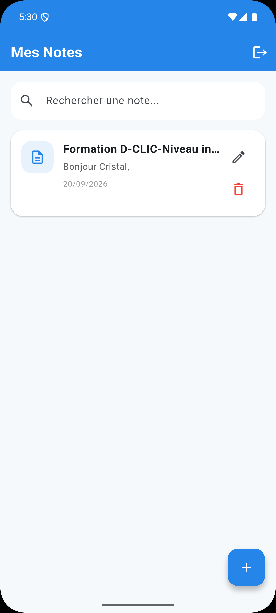
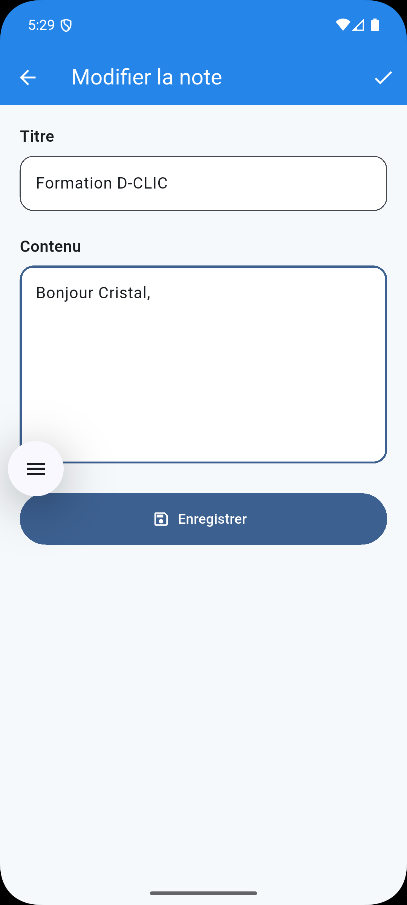

# 📝 Mes Notes — Projet Flutter DCLIC

Application mobile de gestion de notes réalisée avec **Flutter** dans le cadre du projet de niveau intermédiaire de la formation **DCLIC — Développement Mobile**.

L'application permet à un utilisateur de se connecter, puis de créer, consulter, rechercher, modifier et supprimer des notes enregistrées localement sur l'appareil.

---

## 🎯 Objectif du projet

Ce projet a pour objectif de mettre en pratique plusieurs notions étudiées pendant la formation :

- développement d'interfaces avec Flutter ;
- navigation entre plusieurs écrans ;
- programmation asynchrone en Dart ;
- utilisation d'une base de données locale SQLite ;
- opérations CRUD ;
- gestion des erreurs ;
- authentification locale ;
- persistance d'une session utilisateur ;
- conception d'une interface simple et ergonomique.

---

## ✨ Fonctionnalités

### Authentification

- écran de connexion ;
- vérification du nom d'utilisateur et du mot de passe ;
- message d'erreur en cas d'identifiants incorrects ;
- stockage d'un hash du mot de passe dans SQLite ;
- option **Se souvenir de moi** ;
- restauration automatique de la session ;
- déconnexion avec confirmation.

### Gestion des notes

- affichage de toutes les notes ;
- ajout d'une nouvelle note ;
- modification d'une note existante ;
- suppression avec demande de confirmation ;
- recherche par titre ou contenu ;
- affichage de la date de création ;
- persistance des données avec SQLite ;
- actualisation de la liste des notes.

---

## 🛠️ Technologies utilisées

| Technologie | Utilisation |
|---|---|
| Flutter | Développement de l'application |
| Dart | Langage de programmation |
| Material 3 | Interface utilisateur |
| `sqflite` | Base de données SQLite |
| `path` | Gestion du chemin de la base |
| `crypto` | Hachage du mot de passe |
| `shared_preferences` | Conservation de l'état de session |
| Git | Gestion de versions |
| GitHub | Hébergement du code source |

---

## 🗂️ Structure du projet

```text
lib/
├── database/
│   └── database_helper.dart
│
├── models/
│   └── note.dart
│
├── screens/
│   ├── login_screen.dart
│   ├── notes_screen.dart
│   └── note_form_screen.dart
│
├── services/
│   └── session_service.dart
│
├── widgets/
│
└── main.dart
```

### `main.dart`

Point d'entrée de l'application.

Il initialise Flutter, vérifie l'état de la session et décide d'afficher :

- l'écran de connexion ;
- ou directement la liste des notes si l'utilisateur avait coché **Se souvenir de moi**.

### `database/database_helper.dart`

Ce fichier centralise l'accès à SQLite.

Il gère :

- la création de la base de données ;
- les migrations ;
- la table des utilisateurs ;
- la table des notes ;
- l'authentification ;
- l'ajout des notes ;
- la lecture des notes ;
- la modification des notes ;
- la suppression des notes.

### `models/note.dart`

Représente une note dans l'application.

Une note contient notamment :

```text
id
titre
contenu
date_creation
```

### `screens/login_screen.dart`

Interface d'authentification.

Elle vérifie les identifiants auprès de la base SQLite avant d'autoriser l'accès à l'application.

### `screens/notes_screen.dart`

Écran principal de l'application.

Il permet :

- d'afficher les notes ;
- de rechercher une note ;
- de modifier une note ;
- de supprimer une note ;
- d'ajouter une nouvelle note ;
- de se déconnecter.

### `screens/note_form_screen.dart`

Formulaire utilisé pour :

- créer une note ;
- modifier une note existante.

### `services/session_service.dart`

Gère la persistance de la session avec `SharedPreferences`.

Aucun mot de passe n'est enregistré dans `SharedPreferences`.

---

## 🗄️ Base de données

L'application utilise une base SQLite locale :

```text
mes_notes.db
```

Elle contient deux tables principales.

### Table `notes`

```sql
CREATE TABLE notes(
    id INTEGER PRIMARY KEY AUTOINCREMENT,
    titre TEXT NOT NULL,
    contenu TEXT NOT NULL,
    date_creation TEXT NOT NULL
);
```

### Table `users`

```sql
CREATE TABLE users(
    id INTEGER PRIMARY KEY AUTOINCREMENT,
    username TEXT NOT NULL UNIQUE,
    password_hash TEXT NOT NULL,
    salt TEXT NOT NULL
);
```

---

## 🔐 Authentification

Un compte de démonstration est créé automatiquement lors de l'initialisation de la base de données.

```text
Nom d'utilisateur : admin
Mot de passe : 1234
```

Le mot de passe n'est pas enregistré directement dans la base.

L'application calcule un hash à partir du mot de passe et d'un sel avant de le comparer avec la valeur enregistrée dans SQLite.

> Ce mécanisme est adapté à ce projet pédagogique. Une application destinée à la production utiliserait un système d'authentification plus avancé et un algorithme spécialisé de dérivation de mot de passe.

---

## ♻️ Persistance de session

Lorsque l'utilisateur coche :

```text
Se souvenir de moi
```

l'application mémorise l'état de la session.

Elle ne stocke pas le mot de passe dans `SharedPreferences`.

Au prochain lancement, l'utilisateur peut accéder directement à ses notes jusqu'à ce qu'il choisisse **Se déconnecter**.

---

## 📱 Prérequis

Pour exécuter le projet, il faut disposer de :

```text
Flutter SDK
Dart SDK fourni avec Flutter
Android Studio ou VS Code
Android SDK
Un émulateur Android ou un téléphone Android
Git
```

Pour vérifier l'installation :

```bash
flutter doctor
```

---

## 🚀 Installation

Cloner le dépôt :

```bash
git clone https://github.com/Cristal-Invictus/mes-notes-flutter-dclic.git
```

Entrer dans le projet :

```bash
cd mes-notes-flutter-dclic
```

Installer les dépendances :

```bash
flutter pub get
```

Vérifier le projet :

```bash
flutter analyze
```

Afficher les appareils disponibles :

```bash
flutter devices
```

Puis lancer l'application :

```bash
flutter run
```

Pour cibler explicitement un émulateur Android :

```bash
flutter run -d emulator-5554
```

Le nom exact de l'émulateur peut varier selon la machine.

---

## 📖 Utilisation

Au lancement de l'application, l'utilisateur arrive sur l'écran de connexion.

Utiliser le compte de démonstration :

```text
Nom d'utilisateur : admin
Mot de passe : 1234
```

Une fois connecté, l'écran **Mes Notes** apparaît.

Le bouton :

```text
+
```

permet de créer une nouvelle note.

Chaque note possède deux actions :

```text
✏️ Modifier
🗑️ Supprimer
```

La barre de recherche permet de retrouver une note à partir de son titre ou de son contenu.

L'icône de déconnexion située dans la barre supérieure permet de terminer la session.

---

## 🔄 Opérations CRUD

L'application implémente les quatre opérations fondamentales :

| Opération | Fonction |
|---|---|
| Create | Ajouter une note |
| Read | Afficher les notes |
| Update | Modifier une note |
| Delete | Supprimer une note |

Toutes ces opérations utilisent la base locale SQLite.

---

## 🎨 Conception UX/UI

L'interface a été conçue pour rester :

- simple ;
- lisible ;
- cohérente ;
- adaptée à un écran mobile ;
- peu encombrée.

La couleur principale utilisée est :

```text
#2585E8
```

L'application utilise **Material Design 3**.

Les actions importantes sont facilement identifiables :

```text
+       Ajouter
✏️      Modifier
🗑️      Supprimer
↪       Se déconnecter
```

---

## ♻️ Principes d'écoconception

Plusieurs choix contribuent à limiter l'utilisation inutile des ressources :

- données conservées localement ;
- absence de serveur distant pour les notes ;
- absence de requêtes réseau permanentes ;
- interface légère ;
- nombre limité de dépendances ;
- stockage uniquement des informations nécessaires ;
- chargement des notes uniquement lorsque cela est nécessaire.

---

## 🧪 Vérification du projet

Analyse du code :

```bash
flutter analyze
```

Exécution des tests :

```bash
flutter test
```

Lancement de l'application :

```bash
flutter run
```

---

## 🖼️ Captures et wireframes

La documentation visuelle du projet est disponible dans le dossier `docs/`.

- [Architecture de l'application](docs/architecture.md)
- [Wireframes et captures](docs/wireframes.md)

Aperçu rapide :

### Wireframe global



### Exemple de capture — écran principal




## 📚 Documentation complémentaire

- [Architecture de l'application](docs/architecture.md)
- [Wireframes et conception des interfaces](docs/wireframes.md)

Les captures et images de conception peuvent être ajoutées dans le dossier `docs/wireframes/`.

---

## 📌 État du projet

```text
✅ Interface de connexion
✅ Authentification SQLite
✅ Hachage du mot de passe
✅ Gestion de session
✅ Se souvenir de moi
✅ Déconnexion
✅ Liste des notes
✅ Recherche
✅ Ajout
✅ Modification
✅ Suppression
✅ Confirmation avant suppression
✅ SQLite
✅ Persistance des données
✅ Gestion des erreurs
✅ Interface Material 3
```

---

## 👤 Auteur

**Cristal AKOYESSOU**

Projet réalisé dans le cadre de la formation :

**DCLIC — Développement Mobile — Niveau Intermédiaire**

Programme :

**« Formez-vous au numérique avec l'OIF »**

---

## 📄 Licence

Projet pédagogique réalisé dans le cadre de la formation DCLIC.
