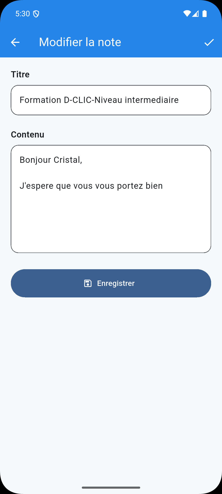

# Wireframes — Mes Notes

## Objectif

Les wireframes ont été réalisés avant le développement afin de définir l'organisation des principales interfaces.

Ils servent de référence pour l'implémentation Flutter.

---

## 1. Wireframe global

Le wireframe principal présente les trois écrans essentiels de l’application :

1. l’écran de connexion ;
2. l’écran principal avec la liste des notes ;
3. l’écran d’ajout / modification d’une note.

---

## 2. Écran de connexion

L’écran de connexion permet :

- la saisie du nom d’utilisateur ;
- la saisie du mot de passe ;
- l’option **Se souvenir de moi** ;
- l’affichage d’un message d’erreur en cas d’échec.

### Capture de l’application

### Correspondance avec le wireframe

Cette interface respecte le wireframe prévu :

- présence du logo ;
- titre **Mes Notes** ;
- formulaire simple et centré ;
- bouton **Se connecter** bien visible ;
- case **Se souvenir de moi**.

---

## 3. Écran principal — Liste des notes

L’écran principal permet :

- d’afficher les notes existantes ;
- de rechercher une note ;
- de modifier ou supprimer une note ;
- d’ajouter une nouvelle note avec le bouton flottant ;
- de se déconnecter.

### Capture de l’application

### Correspondance avec le wireframe

L’interface finale reprend les éléments du wireframe :

- barre supérieure avec le titre **Mes Notes** ;
- champ de recherche ;
- cartes de notes ;
- bouton flottant d’ajout ;
- actions de modification et suppression ;
- icône de déconnexion.

---

## 4. Écran de modification d’une note

L’écran de formulaire est utilisé pour :

- créer une nouvelle note ;
- modifier une note existante.

Il contient :

- un champ **Titre** ;
- un champ **Contenu** ;
- un bouton **Enregistrer** ;
- une navigation simple.

### Captures de l’application

#### Première capture

#### Deuxième capture

### Correspondance avec le wireframe

L’écran final respecte bien le wireframe défini :

- structure simple ;
- hiérarchie claire des champs ;
- formulaire lisible ;
- bouton d’enregistrement bien visible ;
- navigation cohérente avec le reste de l’application.

---

## 5. Synthèse

Les écrans réalisés dans Flutter respectent l’organisation générale prévue au moment du wireframing :

- simplicité de navigation ;
- cohérence visuelle ;
- lisibilité ;
- ergonomie mobile ;
- respect des fonctionnalités attendues.

Le résultat final reste fidèle à la maquette tout en intégrant **Material Design 3** pour améliorer l’apparence et l’expérience utilisateur.
